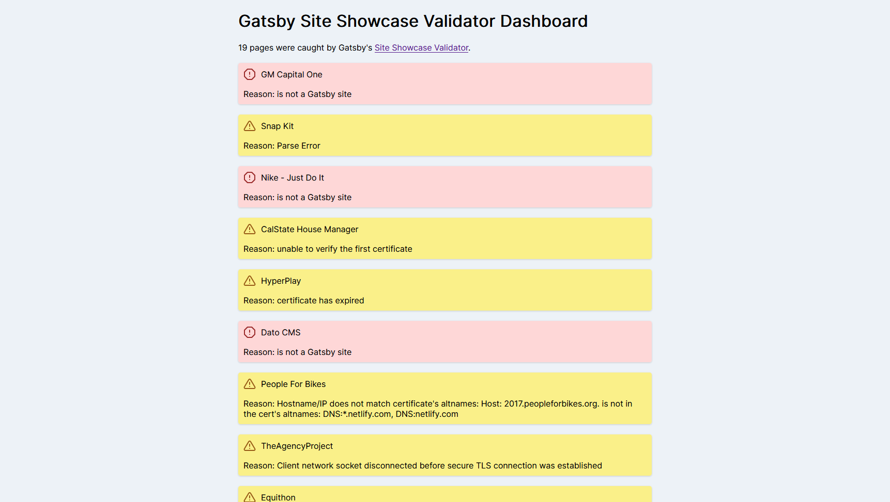

# Gatsby Site Showcase Validator Dashboard

Use the GitHub API to pull down the logs for the showcase validator and then display them in a dashboard. There's a GitHub Actions workflow set up to run once a day to update the dataset in this repo.

